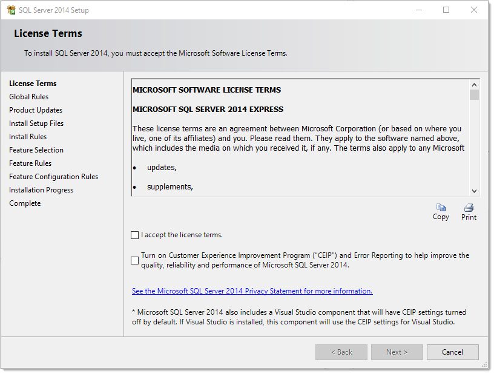
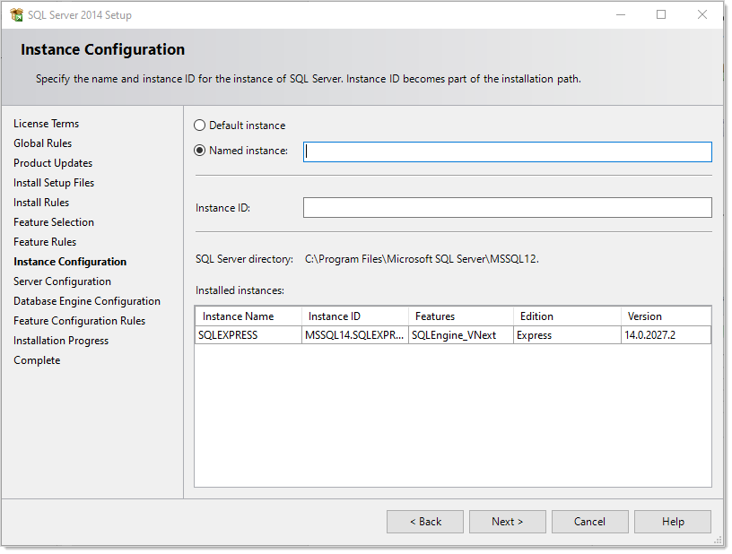

[title]: # (SQL Server 2012 Express Edition Installation)
[tags]: # (Installation, SQL Server Express 2012)
[priority]: #

# SQL Server 2014 Express Edition Installation

## Overview

> **Important:** Thycotic recommends using SQL Express in sandbox or trial environments **only** due to size and performance limitations. 

SQL Express is a free edition of SQL and is available for use with Thycotic products. The following steps walk you through setup and configuration for SQL Server 2014 Express Edition as an example. For the most up to date resources on installing SQL see [Microsoft SQL Technical Documentation](https://docs.microsoft.com/en-us/sql/?view=sql-server-ver15) for more information.

At the completion of this article you will have: 

- Installed a basic stand-alone instance of SQL Server 2014 Express with the minimum features necessary for SQL Server. This includes SQL Server Management Studio and other tools.

- Created a database in SQL for your Thycotic product

- Created a new SQL Server user login for your SQL database

> **Note:** This document uses Thycotic's Secret Server product as example in the instructions, but the same steps apply for Privilege Manager advanced installs.

## Procedures

### Downloading SQL Server Express with Tools

If you plan to use SQL Server Express, we strongly recommend downloading the package that includes **Tools**. This also installs SQL Server Management Studio that allows you to connect to the database directly and gives access to server settings.

Procedure:
$1
$2$1
$2$1
$2
   
$1
$2
   - **ExpressAndTools 64BIT\SQLEXPRWT_x64_ENU.exe**
   - **MgmtStudio 64BIT\SQLManagementStudio_x64_ENU.exe**
$1
$2
### Installing SQL Server Express 2014
$1
$2$1
$2$1
$2
   
$1
$2
   
$1
$2
   
$1
$2$1
$2
   
$1
$2
   > **Note:** A SQL Server instance is isolated from other SQL Server instances. SQL Server instances can operate side-by-side on the same computer.
   
   > **Note:** Management tools include Management Studio support for the database engine and SQL Server Express, SQL Server CLI (SQLCMD), SQL Server PowerShell provider, and the distributed replay administration tool.
$1
$2
   
$1
$2$1
$2$1
$2$1
$2
   
$1
$2
   
$1
$2   
   - **Mixed Mode (for easiest configuration)**: This mode is required if you intend on using a SQL Server account to authenticate Secret Server to your SQL Server instance. **We recommend using mixed mode if you are setting up a test or demo environment**. Selecting this option will also require you to set a password for the SQL Server system administrator (sa) account. See [Adding a SQL Server User ](https://thycotic.force.com/support/s/article/Adv-Install-SQL-2016#user)(section below) for instructions on adding more users.
   
   - **Windows Mode (recommended for best security)**: This mode prevents SQL Server account authentication. We recommend using Windows mode for production environments. Whatever user or group assigned will have administrative access to your SQL instance. According to best security practices, limit this number to as few users as possible. Only choose this if you have experience and require this for a specific issue—we do **not** recommend SQL Server Express for production accounts.
   
   > **Note:** If choosing **Windows Mode** you will also need to  [run the IIS application pool as a service account](../running-ss-iis-app-pool-service-account/index.md) later in the installation process. 
   
$1
$2$1
$2$1
$2
   
$1
$2
### Creating the SQL Server Database

To install SS, the Thycotic installer creates the SQL database for you if it does not exist and if the user account has permission to create a new database, which requires the dbcreator server role.

If not using the Thycotic Installer, use the following steps to create a database manually through SQL Server Management Studio:
$1
$21. Connect to your SQL Server instance.
$1
$21. Type a name for your database in the **Database Name** text box.
$1
$2
### Adding a SQL Server User

According to security best practices, limit the number of users with access to your SQL database as much as possible. Use the following instructions to add a SQL Server account for SS to use to access the SQL database:
$1
$2$1
$2$1
$2$1
$2$1
$2
   - **SQL Server Authentication**:  Use this option to create a new SQL Server account (this requires mixed mode to be enabled). To create the account, enter a new username and password and then deselect the **Enforce Password Policy** check box to prevent the account from expiring.

   - **Windows Authentication**:  Use this option to add access to SQL Server for an existing Windows account. To add the account, enter the login name or click **Search** to find the account. It is recommended to use a domain account rather than a local Windows account.
$1
$2$1
$2$1
$2$1
$2
 