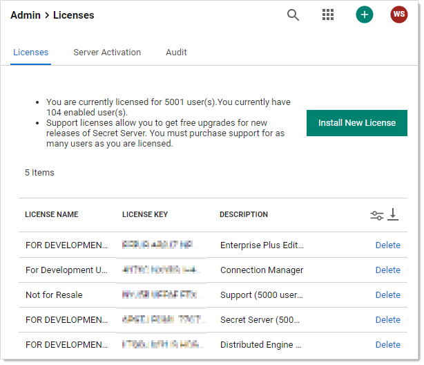
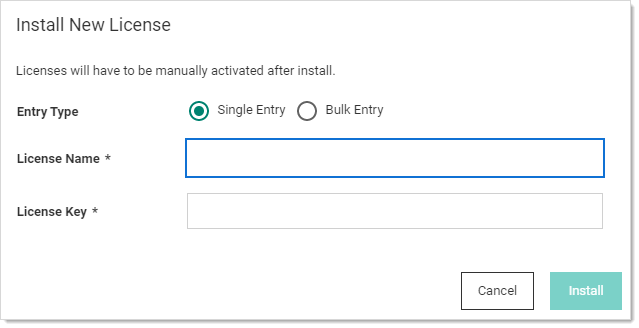
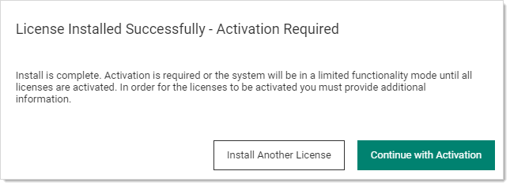
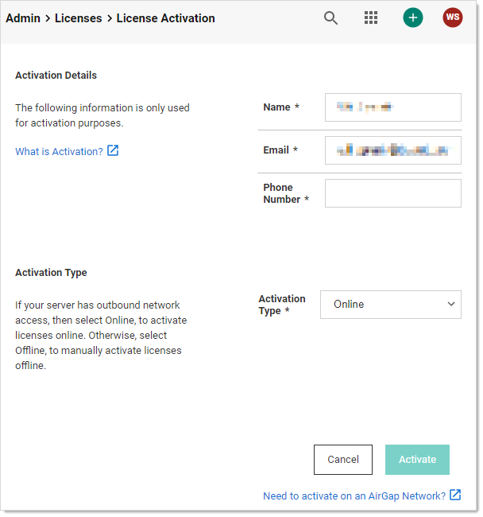
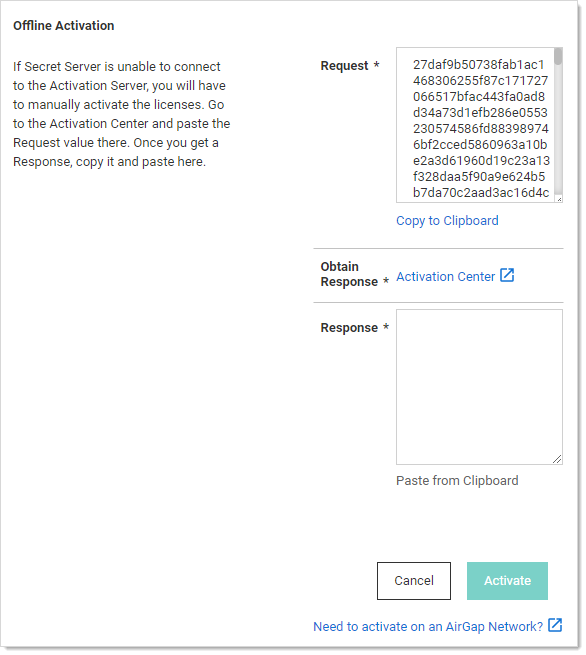

[title]: # (Adding, Activating, Converting, and Deleting Licenses)
[tags]: # (license,add,delete,activate,convert,activation,bulk license)
[priority]: # (1000)

# Adding, Activating, Converting, and Deleting Licenses

This section explains how to add and activate Secret Server licenses (both online and offline) how to delete licenses, and how to convert from a trial license.

>**Note**: For more information on understanding Secret Server licensing, see the [Licensing](../../licensing/index.md) page.

## Adding and Activating Secret Server Licenses Online or Offline

1. Log on to Secret Server as an administrator.

1. Go to **Admin \> Licenses**. The Licenses page appears:

   

1. Click the **Install New License** button. The Install New License popup appears:

   

1. Click to select **Single Entry** in the **Entry Type** selection button.

   > **Note:** If you have numerous licenses, you can click the license **Bulk Entry** selection instead. It allows you to paste an entire licensing email or a formatted list of licenses, adding all licenses in a few clicks. For a small number of licenses, especially if you are new to the process, we recommend using single entry, which provides better feedback on what you are doing.

1. Type (or paste) the **License Name** and **License Key** for the license that you received from your account manager.

1. Click the **Install** button. The License Installed Successfully popup appears:

   

1. If you have another license, click the **Install Another License** button to repeat the process.

1. Click the **Continue with Activation** button. The License Activation page appears:

   

1. Ensure your name, email address, and phone number are present and correct.

1. If you have an internet connection and want to activate **online**:

   1. Click the **Activation Type** dropdown list and select **Online**.
   1. Click the **Activate** button. An Activation Successful popup briefly appears and then disappears, and you are returned to the Licenses page where your new license now appears. The procedure is complete. **Do not do the remaining steps**.

1. If you do not have an internet connection and want to activate **offline**:

   1. Click the **Activation Type** dropdown list and select **Offline**. The Offline Activation section appears:

      

   1. Click the **Copy to Clipboard** link to copy the text in the **Request** text box.
   1. Click on the **Activation Center** link in the **Obtain Response** section. The License Activation Center page appears. Do not close the Secret Server browser tab. 
   1. Paste the copied text into the text box.
   1. Click the **Activate** button. Activation Successful! appears at the top of the page and the text box now contains the activation confirmation.
   1. Copy the entire text box contents.
   1. Return to Secret Server License Activation page and paste the response into the **Response** text area.
   1. Click the **Activate** button. An Activation Successful popup briefly appears and then disappears, and you are returned to the Licenses page where your new license now appears.

>**Note**: For more information on activating Secret Server licenses, see the [License Activation FAQ](../licensing-faq/index.md).

Secret Server may be activated on an air gap network for both trials and licensed products. Please let your Account Manager know you will be using Secret Server on an air gap network for more information.

If you receive an error message, please take note of the error code and call the phone number contained in the message.

If an error message persists after successful activation, remove expired and invalid licenses from Secret Server by following the steps below, under **Deleting Secret Server Licenses**.

If you need help and your Secret Server has a current support license for each user license, please contact our [technical support team](http://thycotic.com/products/secret-server/support-2/).

> **Note:**  For more information on Secret Server licensing and license activation, see [Licensing](../../licensing/index.md) and the [License Activation FAQ](../licensing-faq/index.md).

## Converting Evaluation Licenses

If you had evaluation licenses initially and you recently purchased Secret Server, you need to remove all evaluation licenses before you install your purchased licenses. Follow the steps below, under **Deleting Secret Server Licenses**.

## Deleting Secret Server Licenses

1. Log on to Secret Server as an administrator.

1. Go to **Admin \> Licenses**.

1. In the **Licenses** dialog, click the **License Name** of the license you want to remove.

1. Click **Delete**. The license information will remain available to you from your account at [my.thycotic.com](http://my.thycotic.com).

1. Click **OK**.

1. Verify that the selected license key has been removed from the list.
