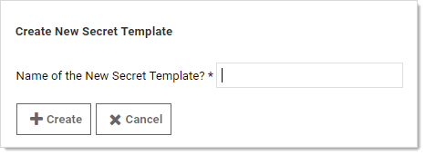

[title]: # (Creating or Editing Secret Templates)
[tags]: # (Template)
[priority]: # (1000)

# Creating or Editing Secret Templates

## General Procedure

Select **Admin \> Secret Templates**. The Manage Secret Templates page appears:

If editing an existing template:

1. Click to select that template in the unlabeled secret template dropdown list.

1. Click the **Edit** button. The Secret Template Designer page appears (see below).

If creating a new template:

1. Click the **Create New** button. The Create New Secret Template pop-up page appears:

   

1. Type the name of the new template in the text box.

1. Click the **Create** button. The Secret Template Designer page appears:

   

   The Secret Template Designer page provides all the options for configuring a secret template, as well as which text-entry fields appear on any secret created from that template.

1. Add template fields as desired. See [Secret Template Settings](../../secret-template-settings/index.md).

1. Click the **Edit** button to customize the template general settings. The Secret Template Designer appears:

   

   These settings are available:

   - **Secret Template Name** check box.
   - **Secret Template Icon** link: Click to change the icon displayed for the template.

   - **Secret Template Name** check box.
   - **Name Pattern Error Message** text box. See [Template Naming Patterns](../../Template-Naming-Patterns/index.md).

   - **Secret Template Name** check box.
   - **Expiration Enabled?** check box: Secret templates allow expiration on certain text-entry fields. When the check box is selected, an expiration time interval can be specified for a selected text-entry field using the dropdown menu. With this option enabled and a time duration specified, SS begins providing alerts if the secret text-entry field is not changed within the specified expiration requirements.

   - **Secret Template Name** check box.
   - **Validate Password Requirements on Edit?** check box: Ensure requirements are met when editing secret.

   - **Field Displayed on Basic Home** dropdown list box: Choose the field that appears on the Basic Home view.

1. Click the **Save** button. The Secret Template Designer page reappears.

1. Select the following buttons to further configure the secret template:

   - **Edit Passwords Button:** Only visible for templates that contain a text-entry field that is of the password type. It is used to alter the minimum password length, as well as the character set used, for the auto-generation of the secret's password. See [Creating Secrets](../../../secret-management/procedures/creating-secrets/index.md) for further details on password auto-generation.
- **Configure Password Changing Button:** Used to enable RPC on these secrets. For details, see [Remote Password Changing](../../../remote-password-changing/index.md).
   - **Configure Launcher Button:** Used to enable Remote Desktop or PuTTY Launcher or custom launchers on these secrets. For details, see [Secret Launchers](../../../secret-launchers/index.md).
- **Configure Extended Mappings Button:** Extended Mappings allows you to tie a text-entry field value to a SS defined system type for additional functionality. For example, you may have a generic password secret template that has a username and password text-entry field. For purposes of looking up credentials, such as a ticket system authentication secret, SS needs to know that actual type of the text-entry fields since the text-entry field name can be custom. Extended mappings available are:
   - **SSH Private Key:** Defines which text-entry fields make up the SSH Key components of Private Key, Private Key Passphrase, and Public Key.
- **Username and Password:** Defines which text-entry fields contain the username and password.
   - **Remote Server SSH Key for Validation:** Ensures the machine SHA1 digest for validating the machine connected to is correct.
- **OATH Secret Key**: For password changing on the Amazon Root Account using the Web Password Changer. If you enter the OATH secret for two factor, SS generates the one-time password (OTP) automatically for password changing and heartbeat, allowing you to automate that while enforcing two-factor authentication on the AWS root credential.

## Specific Template Types

### Oracle Account as SYS

How to setup the Oracle Account secret template to work with Oracle connecting as SYS in SysDBA:

1. Go to **Admin \> Secret Templates**.

1. Set **Oracle Account** as the type.

1. Click the **Edit** button. The Secret Template Designer page appears.

1. Click the **Copy Secret Template** button. The Name New Secret Template popup appears.

1. Type the name in the **Name** text box.

1. Click the **OK** button.

1. Click the **Continue** button. The Secret Template Designer for the new template appears.

1. Click the **Configure Password Changing** button. The Secret Template Edit Password Changing page appears.

1. Click the **Edit** button.

1. Select **Oracle Account (AS SYS)** in the **Password Type to Use** dropdown list.

1. Click the **Save** button.

1. Create a secret based on the new template to test the template.

### SQL Windows Authentication Account Secret Template and Launcher

This instruction creates a new Active Directory template that is specifically for SQL.

> **Note:** You can copy the existing AD template that you have. However, if you copy an existing template that has launchers attached to it, you may need to delete those launchers on the newly created template.

1. Go to **Admin \> Secret Templates**.

1. Set **Active Directory** as the type.

1. Click the **Edit** button. The Secret Template Designer page appears.

1. Click the **Copy Secret Template** button. The Name New Secret Template popup appears.

1. Type the name in the **Name** text box.

1. Click the **OK** button.

1. Click the **Continue** button. The Secret Template Designer for the new template appears.

1. If necessary, create a field called **Server**.

1. [Create a new launcher](../../../secret-launchers/custom-launchers/creating-custom-launchers/index.md), adding the following parameters for Windows settings:
   - Name: SQL Server Launcher - Windows Authentication
   - Active: Yes
   - Process Arguments: -E -S $Server ($Server should match the field name you created or observed earlier)
   - Run Process as Secret Credentials: Yes
   - Load User Profile: Yes
   - Use Operating System Shell: No
   - Use Additional Prompt (in General Settings): No