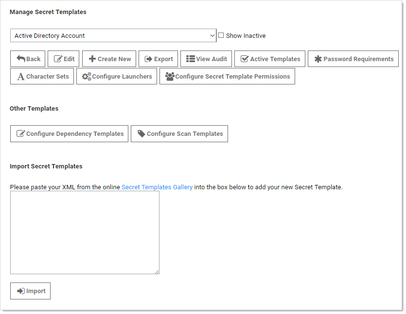
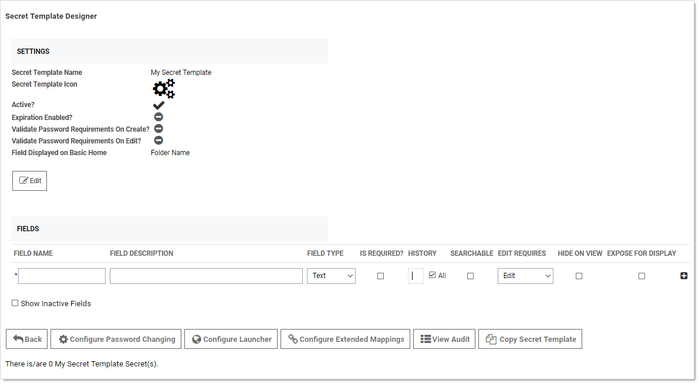
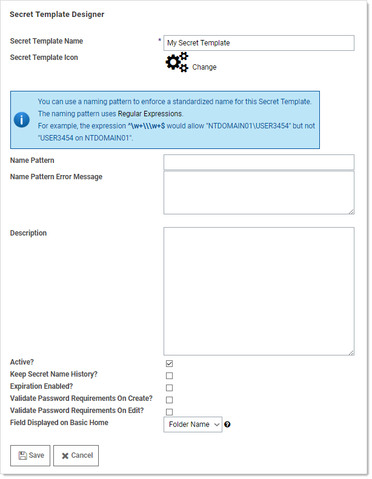

[title]: # (Creating or Editing Secret Templates)
[tags]: # (Template)
[priority]: # (1000)

# Creating or Editing Secret Templates

Select **Admin \> Secret Templates**. The Manage Secret Templates page appears:

If editing an existing template:
$1
$21. Click the **Edit** button. The Secret Template Designer page appears (see below).

If creating a new template:
$1
$2
   
$1
$2$1
$2
   

   The Secret Template Designer page provides all the options for configuring a secret template, as well as which text-entry fields appear on any secret created from that template.

Add template fields as desired. See [Secret Template Settings](../../secret-template-settings/index.md).

Click the **Edit** button to customize the template general settings. The Secret Template Designer appears:

These settings are available:

- **Secret Template Name** check box.

- **Secret Template Icon** link: Click to change the icon displayed for the template.

- **Secret Template Name** check box.

- **Name Pattern Error Message** text box. See [Template Naming Patterns](../../Template-Naming-Patterns/index.md).

- **Secret Template Name** check box.

- **Expiration Enabled?** check box: Secret templates allow expiration on certain text-entry fields. When the check box is selected, an expiration time interval can be specified for a selected text-entry field using the dropdown menu. With this option enabled and a time duration specified, SS begins providing alerts if the secret text-entry field is not changed within the specified expiration requirements.

- **Secret Template Name** check box.

- **Validate Password Requirements on Edit?** check box: Ensure requirements are met when editing secret.

- **Field Displayed on Basic Home** dropdown list box: Choose the field that appears on the Basic Home view.

Click the **Save** button. The Secret Template Designer page reappears.

Select the following buttons to further configure the secret template:

- **Edit Passwords Button:** Only visible for templates that contain a text-entry field that is of the password type. It is used to alter the minimum password length, as well as the character set used, for the auto-generation of the secret's password. See [Creating Secrets](../../../secret-management/procedures/creating-secrets/index.md) for further details on password auto-generation.

- **Configure Password Changing Button:** Used to enable RPC on these secrets. For details, see [Remote Password Changing](../../../remote-password-changing/index.md).

- **Edit Passwords Button:** Only visible for templates that contain a text-entry field that is of the password type. It is used to alter the minimum password length, as well as the character set used, for the auto-generation of the secret's password. See [Creating Secrets](../../../secret-management/procedures/creating-secrets/index.md) for further details on password auto-generation.

- **Configure Extended Mappings Button:** Extended Mappings allows you to tie a text-entry field value to a SS defined system type for additional functionality. For example, you may have a generic password secret template that has a username and password text-entry field. For purposes of looking up credentials, such as a ticket system authentication secret, SS needs to know that actual type of the text-entry fields since the text-entry field name can be custom. Extended mappings available are:

- **Edit Passwords Button:** Only visible for templates that contain a text-entry field that is of the password type. It is used to alter the minimum password length, as well as the character set used, for the auto-generation of the secret's password. See [Creating Secrets](../../../secret-management/procedures/creating-secrets/index.md) for further details on password auto-generation.

- **Username and Password:** Defines which text-entry fields contain the username and password.

- **Edit Passwords Button:** Only visible for templates that contain a text-entry field that is of the password type. It is used to alter the minimum password length, as well as the character set used, for the auto-generation of the secret's password. See [Creating Secrets](../../../secret-management/procedures/creating-secrets/index.md) for further details on password auto-generation.

- **OATH Secret Key**: For password changing on the Amazon Root Account using the Web Password Changer. If you enter the OATH secret for two factor, SS generates the one-time password (OTP) automatically for password changing and heartbeat, allowing you to automate that while enforcing two-factor authentication on the AWS root credential.
