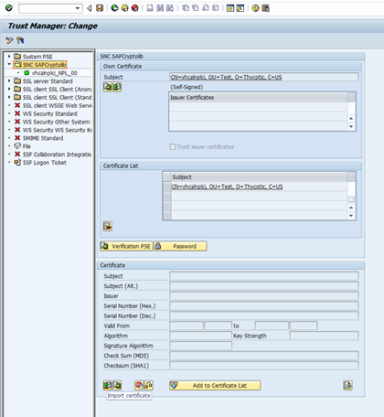
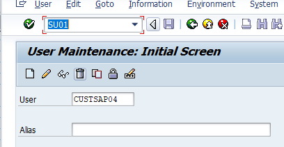
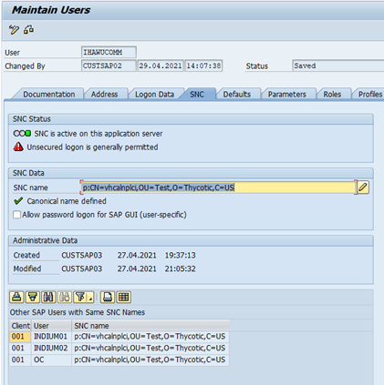
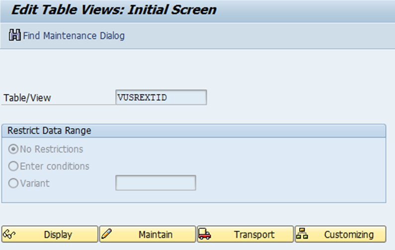
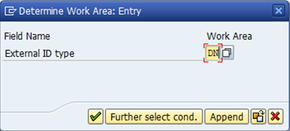
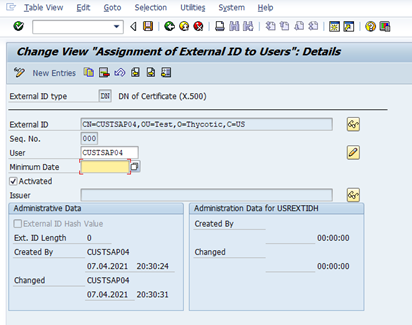
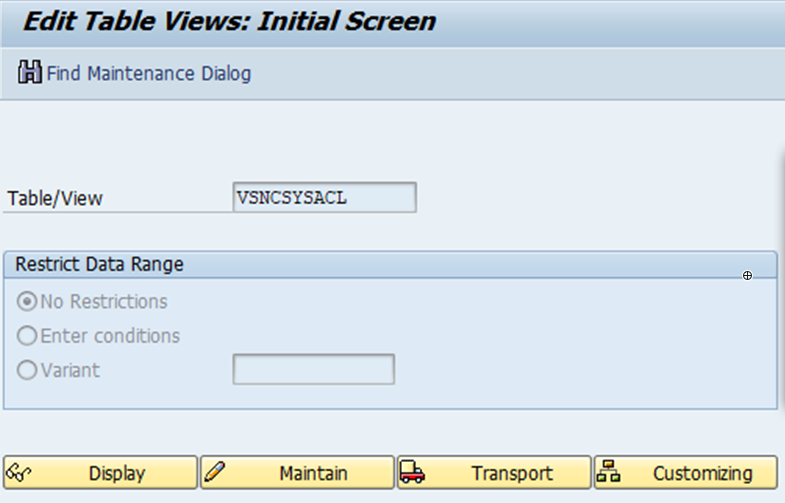
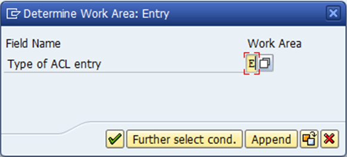
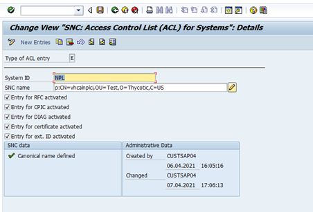

[title]: # "SAP SNC Account Secret Template"
[tags]: # "sap,snc,secret template"
[priority]: # "1000"
[ redirect ]: # "AutomaticExportKnowledgeBase, AutomaticExportRestApiKnowledgeBase"

# SAP SNC Account Secret Template

##  Introduction

The “SAP SNC Account” secret template is an expansion on the original "SAP Account" secret template. It takes advantage of SAP’s Secure Network Communication (SNC), which is a protocol that encrypts communication between Secret Server and an SAP Server. The SAP SNC Account template includes all the original fields from the SAP Account secret, adding a few more as well.

##  New Template Fields

The following is an introduction to the new template fields (in addition to those also found in the SAP Account secret template):

> **Note:** Please see the [SAP .NET Connector 3.0 Programming Guide](https://support.sap.com/content/dam/support/en_us/library/ssp/products/connectors/msnet/dotnet_connector_30_programming_guide.pdf) for additional information.

- **SNC Partner Name:** Matches the snc/identity/as value set in your SAP Server configuration. 

- **SNC My Name:** For most SAP configurations, you can ignore this. See the connector programming guide for cases where it may be required.

- **SNC Quality of Service:** Dropdown list to select the service quality or protection used for SNC communication. Choose one of the following protection options:
  - Authentication Integrity (includes authentication)
  - Authentication Integrity Privacy (includes integrity protection and authentication)
  - Authentication Only
  - Default Protection
  - Maximum Protection
  
- **SNC Single Sign On:** Dropdown list to set to true if you wish to use single sign on. If you set this to false, you authenticate with your username and password on the secret.

- **X.509 Certificate:** Click the **Change** link to upload an X.509 certificate for authentication.

## Server-Side Setup

### Prerequisites

- **SAP Server Setup:** Follow the latest SAP documentation for configuring the SAP server and your SAP users to use SNC. 

- **SAP NCO Files:** As with the original SAP Account template, you include the `SAPNCO.dll` and `SAPNCO_UTILS.dll` files in your Secret Server or distributed engine installation. See [SAP Heartbeat and Password Changing](../../../../remote-password-changing/sap-heartbeat-and-password-changing/index.md) for more information. 

- **SAP Cryptographic Library:** In addition to the SAP NCO DLL files, you need to obtain the SAP Cryptographic Library. This should include the library DLL (`sapcrypto.dll`), the license ticket, and the configuration tool (`sapgenpse.exe`). Add the DLL file to your Secret Server or distributed engine installation following the same steps as the SAP NCO files. For more information on this library, see the [SAP Identity Management Configuration Guide](https://help.sap.com/viewer/4773a9ae1296411a9d5c24873a8d418c/8.0/en-US/3d4ece540ae64e30997498025e37f686.html) . 

- **SAP Server Certificate:** Download your SAP’s server certificate from the STRUST transaction. Assuming you setup your SAP server correctly, this should be located at **STRUST \> SNC SAPCryptolib \> Subject Own Certificate**. Click the **Export Certificate** icon button at the bottom to open a dialog box, which allows you to download the certificate.

### Personal Security Environment Setup

As with your SAP server setup, you should consult the latest SAP documentation for more information when setting up your Personal Security Environment (PSE). These instructions are provided to illustrate the options to configure the SAP SNC Account secret template in Secret Server, but SAP’s documentation may provide more information about your options pertaining to the creation of a PSE. To set up your PSE:

1. In your client environment (your Secret Server or distributed engine server), create a directory to stage your setup. For example, I used `C:\SAPSNC`.

1. Add the two SAP NCO files (sapnco.dll and sapnco_utils.dll), the SAP Cryptographic library (sapcrypto.dll), your ticket license file, and sapgenpse.exe to this directory. 

1. Copy the server certificate you exported from your SAP instance to this directory. 

1. Add two system environment variables to your server:
   - SECUDIR should be the directory you just created (for instance `C:\SAPSNC`)
   - SNC_LIB should be the full path of the SAP Encryption library (for instance `C:\SAPSNC\sapcrypto.dll`).
   
1. Following SAP’s instructions, use SAPGENPSE (or other tools that SAP may provide) to generate the PSE, including the cred_v2 file and the X.509 certificate. See [Configuring the Use of the SAP Cryptographic Library for SNC](https://help.sap.com/doc/207c4450a13d471c9af2c83b0631d532/1511%20002/en-US/frameset.htm?4145453c3ff4110ee10000000a11405a.html). For example, you could run these commands from a command prompt window with Administrator permissions in the `C:\SAPSNC` directory:

   `sapgenpse get_pse -p target.pse -x <PASSWORD> <DISTINGUISHED NAME>`

   `sapgenpse seclogin -p target.pse -x <PASSWORD> -O <DOMAIN\USER>`

   `sapgenpse maintain_pk -a <CERT FILE FROM SAP GUI> -p target.pse -x <PASSWORD>`

   `sapgenpse maintain_pk -v -l -p target.pse -x <PASSWORD>`

   `sapgenpse export_own_cert -o target.crt -p target.pse -x <PASSWORD>`

1. When you create the server credentials with the sapgenpse “seclogin” command,  specify a Windows or Active Directory user for the credentials. You have two options here:
   - Specify the same user who runs your Secret Server or distributed engine as the one who is allowed to use the PSE you just setup. This is the easier option.
   - Specify a different Windows or Active Directory user. If you choose this option, you need to also create a secret for that user in Secret Server as either a Windows or Active Directory secret. Add this secret to your SAP SNC secret’s associated secrets. 

> **Note:** For more information about using the SAPGENPSE tool, see [Creating the Server's Credentials Using SAPGENPSE](https://help.sap.com/doc/saphelp_nw73ehp1/7.31.19/en-US/32/ce2e3ad962a51ae10000000a11402f/frameset.htm).

### Importing PSE information to the SAP GUI

1. As above, refer to SAP’s documentation for details on getting your PSE recognized by your SAP server. This is just an example.

1. Import the certificate you created above ('target.crt' in my example) through the STRUST transaction in the SAP GUI: **STRUST \> SNC SAPCryptolib \> Import Certificate \> Add Certificate to List \> Save**.

   

1. Go to the **SU01** function.

1. Type your SAP user’s name in the **User** text box. 

   

1. Click the pencil icon to edit.

1. In the **SNC** tab, define the SNC name using the syntax: `p:<YOUR USER’S DISTINGUISHED NAME>`.

   

1. Save and exit the **SU01** function.

1. Go to the **SM30** function.

   

1. Type `VUSREXTID` in the **Table/View** text box.

1. Click the **Maintain** button. A dialog box appears:

   

1. Select **DN** as the work area.

1. ==Click the check mark icon?==

   

1.  Click the **New Entries** link. ==Something happens==

1. Fill out the fields as follows:

   1. Replace the **External ID** with your own
   1. Click to select the **Activated** check box.
   1. Save and exit.

1. Return to the SM30 function.

   

1. Type `VSNCSYSACL` in the **Table/View** text box.

1. ==Click the Maintain button? A dialog box appears:==

   

1. Select **E** as the work area.

1.  ==Click the check mark icon?==

1. The System ID should match the system ID in your configuration file path at the beginning of this instruction. The SNC name should be the distinguished name of the server. There should only be one entry in this table for the server.

   

1. Confirm that a “Canonical name defined” message appears.

1. Save and exit

## Creating an SAP SNC Secret in Secret Server

SAP SNC Account secrets are created in the same way as the original SAP Account secrets but have additional fields, as described above. For details that apply to both the SAP Account and SAP SNC Account secrets, see [SAP Heartbeat and Password Changing](../../../../remote-password-changing/sap-heartbeat-and-password-changing/index.md).

If your PSE was created for a Windows or Active Directory user other than the one who runs Secret Server or distributed engine, you need to add that user to your SAP SNC Account secret’s associated users. To do this, add your user as either a Windows Account or an Active Directory secret. Next, open your SAP SNC Account secret and navigate to the Remote Password Changing tab to add that secret as an Associated Secret

If you do not use single sign-on or if you choose to use the username and password without the X.509 certificate for authentication, the X.509 certificate may be omitted. 

## Troubleshooting

**SAP Account Secret Work but SAP SNC Secrets Do Not**

SNC uses port 4800 to communicate. If the original SAP Account secrets work but SAP SNC secrets do not, be sure that port 4800 is not blocked by your firewall or VPN.

**Client-Side Errors**

If you experience client-side errors (such as generating a client certificate), right click on your SAP DLL files (`sapcrypto.dll`, `sapnco.dll`, or `sapnco_utils.dll`), and make sure that they are not blocked by your OS.

**Distinguished Name Errors**

If you run into an error message a distinguished name (DN) error, such as `Exception: LOCATION CPIC (TCP/IP) with Unicode ERROR GSS-API(maj): No credentials were supplied Unable to establish the security context target="p:CN=vhcalnplci, OU=Test, O=Thycotic`, check your spacing in the distinguished name. SAP can be strict about adding or removing the spaces after commas in the DN.