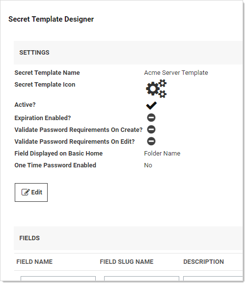

[title]: # "Secret Template List Fields"
[tags]: # "template, template fields, template field settings,secret list fields"
[priority]: # "1000"

# Secret Template List Fields

## Overview

With secret template list fields, administrators can create new lists that can be shared by multiple secrets. Clicking on an existing list goes to the details page for that list where the user can set the list’s name,
description, and the options available in the list. 

You can optionally group list options by category, which make using very large lists easier. For instance, a list of machines might have the machines categorized by function, such as “Web Server” or “Database Server.” You could also use categories for locations, such as “London,” “New York,” or “Tokyo.” 

List categories are displayed on the secret and on the launcher dialog with the options sorted alphabetically within categories, which are also sorted alphabetically. Options
can be duplicated in multiple categories and will show up in each one. In addition to manually adding categories and options, you can upload a file containing the list options. 
Teams (Admin > Teams) – The team details page

## Adding a New List Field

### Task 1: Create the List

1. Go to **Admin \> Lists**. The List page appears:

   

1. Click the **Create List** button. The Create List popup appears:

   

1. Type the name in the **Name** text box.

1. (Optional) Type a description in the **Description** text box.

1. Click the **Save** button. The configuration page for the new list appears:

   

1. Click the **Add** button in the **List Options** section and select **Create Category**. The Create Category popup appears:

   

   > **Note:** If you want a list with no categories, choose Uncategorized for category, and follow these same instruction for adding options.

   > **Note:** You can also create categories from a comma-delimited list in a text file. Select the **Add** button and select **Add from File**. This can be either a list of options, one option per line, or a list of comma-delimited values in the format option,category with one pair per line. Files can also combine these formats, and any line without a comma will be treated as a option without a category.

1. Type the name for the category in the **Category** text box. We typed "Manhattan."

1. Click the **Save** button. The category name now appears in the dropdown list:

   

1. Add another category the same way. We added "Albany."

1. Click the dropdown list to select a category you just added. We chose "Manhattan." A table appears below the dropdown list:

   

   Note that there is no option (list item) listed.

1. Click the **Add** button and select **Create Option**. The Create Option popup appears:

   

1. Type the name for the Option in the **Option Name** text box. We typed "Web Server."

1. Click to select the category the new option will belong to in the **Parent Category** dropdown list. We selected "Manhattan." 

1. Click the **Save** button. The new option appears in the list:

   

1. Add another option the same way. We added "Database Server."

1. Repeat the process for the Albany category. The list new table looks like this:

   

1. For future reference, click the three vertical dots button in the **Actions** column for one of the options. Three actions appear:

   - Update Option: Rename the option
   - Move to Category: Move the option to another category in the same list
   - Delete Option: Remove the option from the category.

    For now, we will not use any of them.

1. You now have a new categorized list available for secrets (via a secret template with the list).

   > **Note:** If you ever want to view past changes to a list or category, click the Audit tab for the list.

### Task 2: Create a Template Using the List

1. Go to **Admin \> Secret Templates**. The Manage Secret Templates page appears:

   

1. Click the **Create New** button. The Create New Secret Template page appears:

   

1. Type the template name in the **Name of the New Secret Template?** text box. We typed "Acme Server Template."

1. Click the **Create** button. The Secret Template Designer page for that new template appears:

   

1. Go to the **Fields** section:

   

1. Type `Server` in the **Field Name** text box for the first (and currently only) field.

1. Click the **Type** dropdown list for the field and select **List**.

1. Click the blue floppy disk (save) icon on the far right of the table row.

1. Click the **Configure Launcher** button. The Secret Template Edit Launcher Configuration page appears:

   

1. Click the **Add New Launcher** button. The Secret Template Edit Launcher Configuration page appears:

   

1. 

1. 

1. Click the **Home** button in the main menu to return to the Secret Server dashboard.

### Task 3: Create a Secret

1. Click the **+** next to **Secrets** on the main menu to create a new secret based on the template you just created. The Create New Secret popup appears:

   

1. Click the secret template you just created in the **Choose a Secret Template** list. Another Create New Secret popup appears:

   

1. Note that one of the dropdown lists has the same name as the list field you created earlier. Click it, and you see the list categories you created. The list is available for that secret's launcher.

