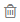
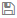

[title]: # "Secret Template Fields"
[tags]: # "template, template fields, template field settings"
[priority]: # "1000"

# Secret Template Fields

> **Note:** If you want to programmatically manipulate fields, see [Field Slug Names](../field-slug-names/index.md).

> **Note:** To use a custom SSH RPC port, add a field named "Port" to your secret template. Empty port fields are equivalent to the default port, 22.

## Field Types

Template fields can be specified as one of several different types to enhance customization:

- **File:** File attachment link. File attachments are stored in the Microsoft SQL Server database.
- **General List:** Preconfigured selectable list for launcher enhancement or general use. See [Secret Template List Fields](../secret-list-fields/index.md).
- **Notes:** Multi-line text-entry field.
- **Password:** Password type text-entry field.
- **Text:** Single-line text-entry field.
- **URL:** Clickable hyperlink.
- **URL List:** Preconfigured selectable list for general use. See [Secret Template List Fields](../secret-list-fields/index.md).

## Editing Fields

The secret template designer provides several settings to customize secret template text-entry fields:

- To add a secret text-entry field, fill out the values and click the **+** button.
- To delete a text-entry field, click the  icon. There is a confirmation dialog box before deletion takes place.
- To edit a text-entry field, click the icon. Click either the  icon to save or the **X** icon to discard the changes.

## Text-Entry Field and Control Settings

The settings available for text-entry fields are:

- **Field Name:** Name of the text-entry field. This name is used for the Create New drop-down list on either the Dashboard's Create Secret Widget or Home page.
- **Field Description:** Description of the text-entry field.
- **Field Type:** Type of the text-entry field. See below for a description of the different text-entry fields.
- **Is Required:** Whether the text-entry field should require a value. These check boxes are checked for correct content when the user attempts to create this secret. A validation error is displayed if not entered correctly.
- **History:** Number of values to keep in the text-entry field's history of values.
- **Searchable:** Whether that text-entry field should be indexed for searching. By default, passwords are not indexed. File attachments and history cannot be indexed for searching.
- **Edit Requires:** Minimum permissions on the secret needed in order to edit the value on the secret. The options are Edit, Owner and Not Editable. This enables the secret text-entry field to be locked down at a more granular level than other text-entry fields on the template.
- **Hide on View:** If checked, this text-entry field is not displayed to users when viewing the secret. The text-entry field is only be displayed when the secret is in Edit mode.
- **Expose for Display:** If checked, this text-entry field is available to be displayed as a Custom Column on the SS Dashboard.

> **Note:** All text-entry fields that are set to "Expose for Display" are **not** encrypted in the database. Only check this value if the secret text-entry field data is not considered privileged information.

The order of the text-entry fields in the Template Designer grid is the same as those that appear when the user views or edits a secret created from the template. The order can be modified through the up and down arrows on the grid.

Default values can be specified on each text-entry field by clicking the edit defaults  button . These added values appear as a list on any secret created from this template.
