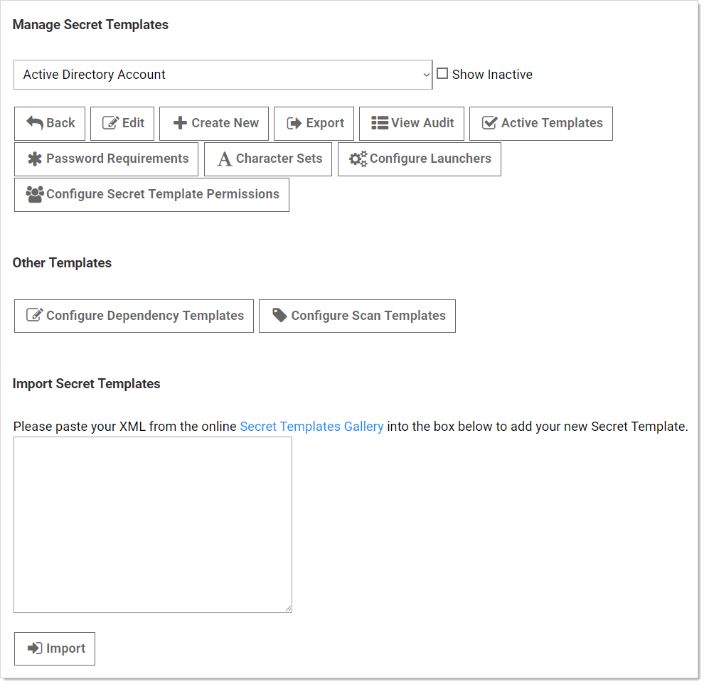

[title]: # (Template Password Requirements)
[tags]: # (Template)
[priority]: # (1000)

# Template Password Requirements

> **Note:** Please click the table of contents on the left to see any sub-pages to this one. Click the table of contents on the right to see headings on this page.

## Overview

A password requirement is a stored SS object that defines the requirements on a password text-entry field to validate user-entered passwords or make auto-generated passwords conform to set specifications. You can have multiple password requirements, but only one can be set to the default.

A password requirement is made up of a minimum and maximum length, a set of characters, and optional rules such as "At least three upper-case characters" or "The first character must be lower-case". The default password requirement is 12 characters from the default character set, with at least one upper-case, lower-case, numeric, and symbol character. 

## Creating a Custom Password Requirement

To create a new password requirement:

1. Go to **Admin \> Secret Templates**. The Manage Secret Templates page appears:

   

1. Click the **Password Requirements** button. The Password Requirements page appears:

   

1. Click the **Create New** button.

   

1. Type the name of the new password requirement in the **Name** text box.

1. (Optional) Type a description of the new password requirement in the **Description** text box.

1. If you want the password requirement to become the new default, click to select the **Is Default** check box.

1. Type the minimum and maximum password lengths for generated (by SS) passwords in the **Generate Length Between** text boxes.

1. Click the **Using** dropdown list to select the character set to use. You can also create a custom character set (or view the contents of a current one) by clicking the **Character Set** link. The out-of-the-box default is `abcdefghijklmnopqrstuvwxyzABCDEFGHIJKLMNOPQRSTUVWXYZ1234567890!@#$%^&*()`. 

1. Click to select the desired password no-no check boxes in the Password Validation section. The options are:

   - **Prevent Username in Password**: Do not allow the username to be part of the password.
   - **Prevent Common Dictionary Words**: Do not allow everyday English words in the password.
   - **Prevent Spatial Terms in Password**: Do not allow strings of characters based their order on the keyboard, such as `qwerty` or `asdfg`.
   - **Prevent Sequences in Password**: Do not allow strings of characters based on their order in the character set, such as `abcd` or `5678`.

1. Create rules for the password requirement.

   1. If necessary, click the **+** icon in the **Character Set Validation** section to create a blank rule.
   1. Click the **Character Set Validation** dropdown list to select either **Minimum of** or **Starts with**. The former set characters that must be present in the password, and the latter sets what characters the password must start with.
   1. Type the number of characters that must be present or start with in the unlabeled text box.
   1. Click the **from** dropdown list box to select the character set to use.

1. Repeat the process to add any additional rules.

1. Click the **Save** button.

> **Note:** To set a custom password requirement for a specific secret, use the “Customize Password Requirement” in the Security tab of a secret.

> **Note:** You can enable or disable the validation of manually entered passwords at the secret template level via the "Validate Password Requirements on Create" and "Validate Password Requirements on Edit" settings.

> **Note:** The "What Secrets Do Not Meet Password Requirements" report shows secrets containing a password that does not meet the password requirements set for its secret template.

> **Note:** Password requirements cannot include rules with overlapping character sets. For example, if an attempt is made to add both a "Minimum of 1 upper-case" rule and a "Minimum of 3 Default" rule to a new password requirement, an error displays.
