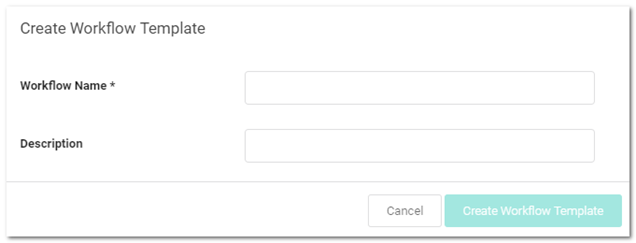
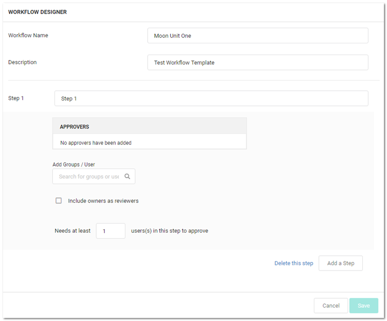

[title]: # (Creating New Workflow Templates)
[tags]: # (Workflow)
[priority]: # (40)

# Creating New Workflow Templates

**Task 1:** Access the Workflow Designer:

1. Click the **Create Workflow Template** button.

   

1. Type the workflow template's name and descriptions in their text boxes. Once you type the name, the Create Workflow Template button becomes enabled.

1. Click the **Create Workflow Template** button. The Edit page for the new workflow template appears.

​A new workflow template has only one empty step by default.

**Task 2:** Set up the first step:

1. (Optional) Type a name for the first step in the **Step 1** text box, such as "Line Managers."

1. Click the **Add Groups / Users** (search) text box.

1. Type the name of the user or group you desire as approvers, options appear in the dropdown.

1. Click the desired user or group. It appears in the Approvers table:

   

1. Repeat as desired.

1. (Optional) To automatically include the owner of the secrete the template is assigned to, click to select the **Include owners as reviewers** check box.

1. (Optional) If you wish to have multiple approvers required on the step, type the minimum required in the **Needs at least...** text box.

**Task 3:** (Optional) Add more steps:

1. Click the **Add a Step** button. A new step appears below the first one:

   

1. Repeat the process for step one.

1. (Optional) Keep adding steps till satisfied.

1. Click the **Save** button to create the access-request workflow template. The template exits editable mode:

   

1. Click the **Workflow Templates** link on the top of the page to return to the table.
