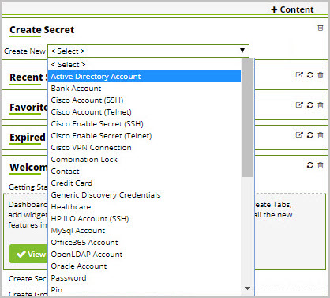
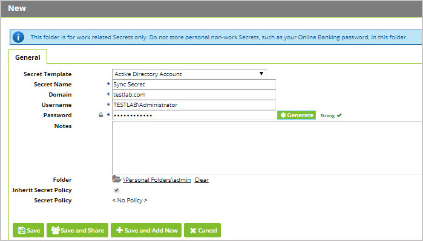
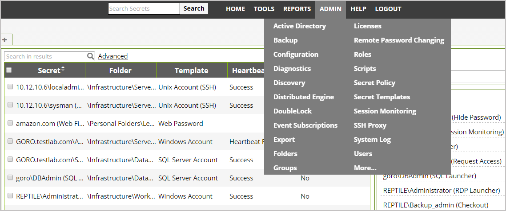
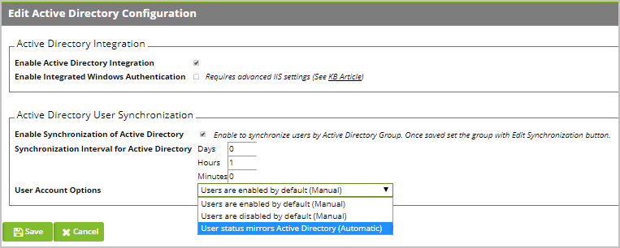
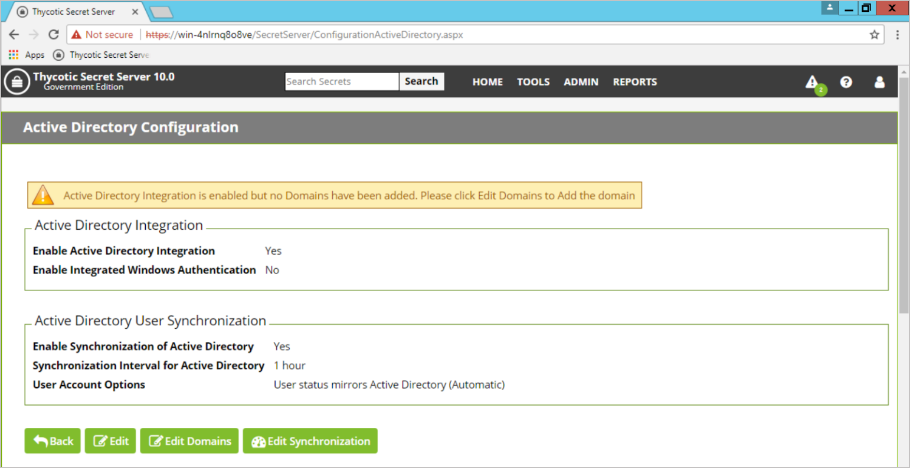
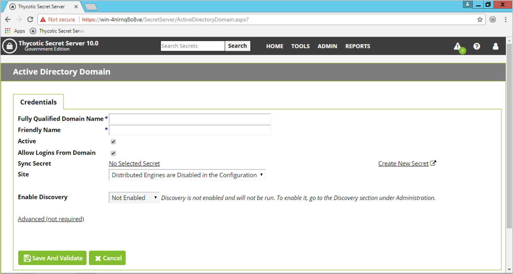
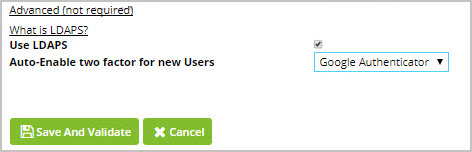
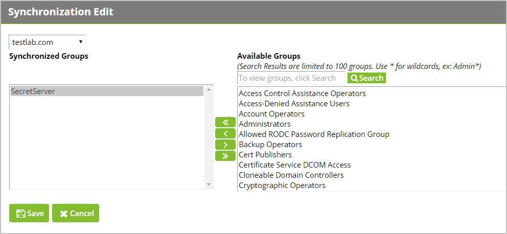

[title]: # (Managing Domain Users)
[tags]: # (common criteria,security,domain users,active directory)
[priority]: # (1007)
[display]: # (none)

# Managing Domain Users

## Configuring Active Directory Sync

Secret Server can integrate with Active Directory by allowing users to use their
Active Directory credentials to login to Secret Server. According to Common
Criteria compliance, Active Directory relies **on LDAPv3 (RFC 2251) protocol**,
which is not configurable by users.  

In order to setup Active Directory in Secret Server, you will need to:

1. **Create a Sync Secret**

2. **Specify the domain to authenticate against**

3. **Configure TLS with Active Directory**

4. **Set Synchronization Groups**

5. **Turn on Active Directory Sync**

Secret Server relies on a primary Sync secret to connect to the LDAPv3 server
in Active Directory. Once connection has been made to Active Directory through
this secret, Secret Server needs to know which domain within Active Directory to
authenticate against, and within that domain which specific Active Directory
Group(s) to synchronize with. The Active Directory Sync in Secret Server targets
user account credentials from Active Directory. Secret Server will categorize
users according to group information from Active Directory, but **Secret Server
does not create, delete, or alter Active Directory Group Policies**.

### Create a Sync Secret

Before synchronizing users, you must first create a secret to be used as
the Sync Secret. This secret should contain **Domain Admin credentials** (or an
account with appropriate permissions for **Read Access** to all your
organization’s AD objects).

From Secret Server’s dashboard you can create this secret through the Create
Secret Widget. 

1. Next to “Create New,” select **Active Directory Account** from
the dropdown list.

   

1. Add a **Secret Name** and provide the **Domain Name**, **Username**, and
**Password** for the Sync Secret that will be able to access Active Directory
with Admin credentials. **Save**.

   

### Specify the Domain & Enable Active Directory Integration

Specify which domains Secret Server will be able to authenticate against.
Secret Server can synchronize with any number of domains.  

1. Once logged into Secret Server – Click on **Admin** \| **Active Directory**  

    

1. From the AD Configuration page, click **Edit.**
1. Check **Enable Active Directory Integration** in the Active Directory Integration section
1. Select **Enable Synchronization of Active Directory** in the Active Directory User
    Synchronization section
1. Wait a few seconds for the screen to update
1. Next to **User Account Options** select **User status mirrors Active
    Directory (Automatic)** from the drop-down. This allows
    Secret Server to mirror any changes made to Active Directory automatically.

1. Click **Save**

    

1. Click **Edit Domains**

    

1. Click **Create New**

1. Provide the **Fully Qualified Domain Name**
1. Provide a **Friendly Name**
1. Ensure that the box next to **Active** is checked.
1. Check the box next to **Allow Logins From Domain**.
1. Select your Sync Secret by clicking **No Selected Secret** 
1. Search for the secret created earlier.
1. Click **Save and Validate**.  

    

The Active Directory Sync Secret will be used to synchronize users and groups,
**it will require permission to search and view the attributes of the users and
groups.  If you plan on using Discovery (NOTE: Discovery is not under Common
Criteria’s scope), the account will also need permissions to scan computers on
the network for accounts.**

### Configuring TLS with Active Directory

To ensure that TLS is configured with Active Directory:

- From the **Admin \| Active Directory** \| **Edit Domains** \| **Create New**
    page (continuing from previous section), after entering the requested
    information, click **Advanced (not required)** and check the **Use LDAPS**
    box to enable. Click **Save And Validate** to save this domain.

   

*\*If the TLS connection to Active Directory fails, the user will be notified
and the failure will be logged. Secret Server does not automatically retry to
connect to TLS but will retry the next time a user attempts to connect to AD.*

More information for setting up Active Domain with LDAPS can be found at

<https://blogs.msdn.microsoft.com/microsoftrservertigerteam/2017/04/10/step-by-step-guide-to-setup-ldaps-on-windows-server/> **"We're no longer updating this content regularly."**

### Setup Synchronization Groups

Once the domain has been added, click the “**Edit Synchronization**” button on
the Active Directory Configuration page.

   

The Available Groups represent all accessible groups on the specified Active
Directory domain. The user membership can be previewed with the Group Preview
control.

- Select the desired group from the Available Groups that contains the Active
    Directory accounts for users you would like to create in Secret Server and
    move it into the **Synchronized Groups** area, click **Save**. This allows
    you to tailor specific Active Directory users to have domain accounts in
    Secret Server.

## Managing Domain Credentials

### Updating Domain Credentials

Updating Active Directory (AD) Credentials and passwords happens directly
through Active Directory and syncs with Secret Server according to a schedule.
You can synchronize your Active Directory accounts at any time by navigating to
**Admin \| Active Directory** and clicking the **Synchronize Now** button. *You
cannot add or edit Active Directory credentials through Secret Server directly*.

When a user logs into Secret Server using Active Directory credentials or uses
an AD account to launch a session, the credentials are sent to the Domain
Controller in real time for authentication verification. Therefore, if an AD
user account has been updated or removed, changes will be reflected immediately
in Secret Server.

### Failed Domain Authentication

If the connection between Secret Server and the AD domain breaks, domain users
will fail to authenticate into Secret Server until the connection is
re-established. Secret Server will log all failed authentication attempts by
users.

To find these audit logs, navigate to **Admin \| Users \|** select a user **\|
View Audit** or refer to section **12.0 Local Auditing**.
