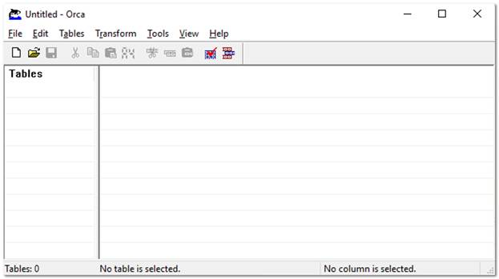

[title]: # (Installing the Advanced Session-Recording Agent)
[tags]: # (Session Recording)
[priority]: # (1000)

# Installing the Advanced Session-Recording Agent

## Overview

By default, Secret Server session recording creates videos of launched sessions. Secret Server supports logging additional metadata, keystrokes for RDP and SSH sessions, and process activity for Remote Desktop Protocol (RDP) sessions. When these options are enabled, users can search for keystrokes or applications across sessions and the session playback interface displays the additional information.
SSH metadata relies on the Secret Server SSH proxy. As of Secret Server 10.6, recording Remote Desktop session metadata requires the installation of an Advanced Session Recording Agent (ASRA) on the target server. In this scenario Secret Server’s protocol handler is still used to launch the session and record the session video, and the ASRA records the metadata only.
As of 10.6.24, ASRA can optionally record any session on the target server. If enabled and the session was not launched from Secret Server, the ASRA will record both video and metadata for the session and upload both to Secret Server once the session is disconnected. This works even if someone logs into the console directly or Remote Desktops to the server without using Secret Server at all. Live viewing of this type of session is not supported.
If you are licensed for session recording, you can install unlimited numbers of ASRAs.

## How Advanced Session Recording Agents Work

1. Once the ASRA is installed, it contacts the ASRA callback URL to determine if it should record metadata or video any time someone logs on to the computer.
1. A user logs on.
1. The ASRA sends Secret Server the computer’s hostname, the username of the user who logged on, any domain name if available, and a list of the computer’s IP addresses.

   >**Note**: This data is not logged by Secret Server unless you enable DEBUG logging, only for troubleshooting purposes.
1. Secret Server checks for any recently-launched protocol handler sessions with matching details, and tells the ASRA if it should record the session.
   * If there is a match, the ASRA starts recording metadata and sends it back to Secret Server over the chosen response bus for the duration of the session.
   * If there is no match and "Record All Sessions" is enabled for the ASRA, the ASRA records both the video and metadata for the session.
   * If there is no match and "Record All Sessions" is not enabled, the ASRA records no video or metadata and waits for the next person to log in.
1. Once a recording session has been closed:
   * If the session was launched from Secret Server using the protocol handler, the video from the protocol handler is matched up to the metadata provided by the ASRA and combined.
   * If the session was not launched from Secret Server and "Record All Sessions" is enabled, the ASRA uploads both the video recording and the metadata to Secret Server.
1. On the Session Monitoring page, additional icons are presented based on what extra metadata is present for that session, such as keystroke data for both RDP and SSH, and process data for Remote Desktop Protocol (RDP).
1. Once the session recording has been processed, on the Session Playback page the additional metadata is visible:

   

And on the Session Monitoring page:

In this example, we searched for activity where the user typed in the word “powershell.”

### Record All Sessions

As of Secret Server 10.6.24, recording video and metadata for all sessions on a server including console access requires Distributed Engine and ASR to be enabled as described above. ASRA must be installed on the target server, and it must be set to "Record All Sessions." If the server is set to “Only Record Secret Sessions,” the ASRA will only provide metadata when people launch into the server from Secret Server.
When recording all sessions, they appear on the Session Monitoring page. They are not tied to any specific secret because the sessions are not started by Secret Server.

## Secret Server Configuration

First, session recording must be enabled (**ADMIN \> Configuration \> Session Recording**). As that page warns, Thycotic highly recommends using RabbitMQ when using session recording in any production environments. See the Configuring Session Recording KB article for more information. Broken: https://thycotic.force.com/support/s/article/Configuring-Session-Recording
https://docs.thycotic.com/ss/10.9.0/session-recording/configuring-session-recording/index.md

### SSH Metadata

To record SSH keystroke data, enable the SSH proxy (**ADMIN \> SSH Proxy**). Individual secrets then require configuration of the Enable Proxy setting and the Enable Session Recording setting. Then when the SSH session is launched and recorded, keystroke data is recorded, which can be searched and is displayed in the session playback interface. See the SSH Proxy configuration KB article for more information. Deprecated: https://thycotic.force.com/support/s/article/SSH-Proxy-Bandwidth https://docs.thycotic.com/ss/10.9.0/networking/ssh-proxy-configuration/index.md

### Remote Desktop Metadata

To record RDP session metadata, first distributed engine needs to be enabled (**ADMIN \> Distributed Engine**) with an appropriate response bus site connector, which should be a RabbitMQ site connector in production environments. The ASRAs will communicate with the chosen site connector to return any recorded metadata.
Next, the Advanced Session Recording feature must be enabled (**ADMIN \> Configuration \> Session Recording \> Configure Advanced Session Recording**), and an ASRA callback URL entered. HTTPS should always be used in production environments.
Individual secrets then just need the Enable Session Recording setting enabled, and the computer you launch into must have the ASRA installed. The secrets do not have to use SSH proxy since the ASRA is what records the metadata.

### Session Recording Worker Role

As of Secret Server 10.6, there is a dedicated Session Recording Worker role. If you have a clustered Secret Server environment, you can pick which nodes process recordings on the **ADMIN \> Server Nodes** page. In a large environment with many recordings, you can configure nodes to be dedicated just to session recording, letting other nodes run the Background Worker and other roles.
Session recording processes multiple videos at once, which can be controlled with the PrefetchCount.ConvertVideoMessage AppSetting (default: 2). We recommend setting this AppSetting to half the number of CPU cores on the server as a starting point. This setting applies only when using a RabbitMQ site connector, which is another reason Thycotic highly recommends using Rabbit if you are using session recording.

### Advanced Session Recording Agent

First, create one or more collections to group the ASRAs together, for example, for different domains or environments. Each collection has a unique installer that you can download from their page – the installer is customized to know which collection it is associated with.
On the collection, you can specify if you want new agents to **Record All Sessions**, or to **Only Record Secret Sessions**. New agents adhere to this setting, and you can toggle it for individual agents, once they have registered.

## Agent Manual Installation

The downloaded installer can be manually installed on a computer by running the setup.exe inside the zip file. It can also be deployed using group policy software installation or other MSI management software.
The ASRA installs itself in C:\Program Files\Thycotic Software Ltd\Session Recording Agent and adds a Windows service, Thycotic Session Recording Agent.

   >**Note**: Only 64-bit Windows operating systems are currently supported. .NET Framework 4.5.1 or greater is also required.

## Agent Updates

The ASRA does not automatically update, so new versions must be manually installed or re-deployed using the Group Policy MMC.

## Agent Uninstallation

You can deactivate specific ASRAs or an entire collection in Secret Server, and the next time the ASRA reaches out to the ASRA callback URL, it will uninstall itself. Since it only reaches out when someone logs on to the computer, it will remain uninstalled until someone logs on again.
The ASRA can also be manually uninstalled directly on the computer like any normal Windows application, but then Secret Server will still show it in the list of active ASRAs under its collection. It should also be deactivated in Secret Server to keep the agent list accurate. If "Record All Sessions" is enabled for this server, you will get a prompt to stop the Thycotic Session Recorder application when you attempt the uninstall because it is running and recording your session, as expected. To avoid these issues, we recommend using the Deactivate feature in Secret Server and then logging into the machine, and it will uninstall itself on its own.

## Agent Group Policy Installation

### Task 1: Review the Prerequisites

The ASRA requires a 64-bit operating system with .NET Framework 4.5.1 or greater installed on the client machine. This is the version that ships with Windows 8.1 and Windows 2012 R2.

### Task 2: Download the Advanced Session Recording Agent Installer

1. Log on to Secret Server.
1. Go to **Admin \> Configuration \> Session Recording \> Configure Advanced Session Recording**.
1. Click on an existing collection, or create a new one, as appropriate.
1. Click the **Download Session Recording Installer** (64-bit) button. The installer is downloaded to your computer.

   >**Note**: The zip file is customized for each collection. Be sure to download the installer from the collection you want your new ASRAs associated with.

### Task 3: Customize the Installer

For a normal manual installation, you extract the zip file, and run setup.exe. There are settings saved in setup.exe.config that customize the installation of the MSI file contained in the zip (gsresvc.msi). When you deploy the ASRA using Group Policy software installation instead of a manual one, the only other files in the zip you need is the MSI, which is deployed from a network share, and an MST (Master Software Tools?) “Transform” file which configures the custom settings.

1. Install Microsoft’s free MSI editing tool, Orca if you do not already have it installed.
1. Extract the ASRA zip file into its own folder.
1. Right click on the MSI file (gsresvc.msi) in the folder where you extracted the zip and select **Properties** to verify that there is a **Digital Signatures** tab indicating that the MSI was signed by Thycotic Software.
1. Launch Orca.

   

1. Open the extracted MSI file (gsresvc.msi). The Tables list appears.
1. Click the **Transform** menu at the top 
1. Select **New Transform**.
1. In the **Tables** list, click **ServiceInstall**. Only one row should be listed on the right.

   

   >**Note**: This screen shot shows the Arguments column dragged wider to see its contents. When you initially see it, it will be very narrow, barely showing the contents.
1. Scroll to the **Arguments** column and copy and paste its contents into a text editor. It should look like this example. Be sure to select the entire column. You might need to adjust the column width.

   >**Note**: The entire string of text is essentially a CLI command with parameters that begin with a hyphen. For illustration purposes we put each parameter on its own line below.

   runSessionRecordingAgent

   -ProductCode=[ProductCode]

   -Installer.Version=10.6.000000

   -E2S.ConnectionString=[E2S.CONNECTIONSTRING]

   -E2S.UseSsl=[E2S.USESecret ServerL]

   -E2S.AuthorizationGuid=[E2S.AUTHORIZATIONGUID]

   -E2S.OrganizationId=[E2S.ORGANIZATIONID]

Everything highlighted is what we will customize. The fields in brackets are what setup.exe would normally customize.

1. In your text editor, open the setup.exe.config XML file from the zip. You will get the Globally Unique Identifier (GUID) from it.
1. In your text editor, replace each of these with the correct values as listed below. The GUID will require looking in setup.exe.config in the <appSettings> XML block. The values are as follows:
   * **ProductCode** should always be: “{A7FA0ADA-BEED-4841-9D3E-9D700B36F653}” (not in setup.exe.config).
   * **Installer.Version** should match your Secret Server version (visible in Secret Server in the bottom right corner).
   * **E2S.ConnectionString** is the callback URL configured on the Advanced Session Recording page.
   * **E2S.UseSsl** is True or False, based on if you are using HTTP:// or HTTPS:// for the callback URL (Secret ServerL should always be used in production).
   * **E2S.AuthorizationGuid** is a unique GUID specific to the ASRA collection that you downloaded the installer file from. You can find it in the setup.exe.config file (in setup.exe.config). This is unique for each ASRA Collection.
   * **E2S.OrganizationId** should always be: 1.

For example:

  

1. Back in Orca, delete everything in the ServiceInstall Arguments column.
1. Copy and paste the customized version you just created from your text editor into the Arguments column.
1. Click the **Transform** menu.
1. Click **Generate Transform**.
1. Save the file as gsresvc.mst in the folder you extracted the installer into. This transform file now contains your customizations for the ServiceInstall Arguments.
1. Close Orca.
1. Check the MSI file’s digital signature again to ensure that it was not edited: If you right-click the MSI file and select **Properties** again, the Digital Signatures tab should still show that the MSI is signed by Thycotic Software. You created your own custom MST transform file, but the MSI itself should be unchanged. Orca can edit the MSI file itself, but that will invalidate Thycotic’s digital signature and it is unnecessary.

### Task 4: Set up a Network Share

1. Place the gsresvc.msi and gsresvc.mst files on a network share on your domain controller.
1. Give “Authenticated Users” read access to this share.

   >**Note**: Computers in the domain will access this network share to get the installer files before any users log into the machine. It will be the machine account authenticating to the network share, before any users have logged in.

### Task 5: Create a Group Policy with Software Installation to install the MSI

1. Open the group policy management console (**Start\ > Administrative Tools \> Group Policy Management**).
1. Expand the **Forest** and **Domain** nodes until you locate the domain on which you are installing the ASRA.
1. Right click on **Group Policy Objects** and click **New**.
1. Enter a descriptive name for your GPO, such as “Thycotic Session Recording Agent Installation, and click **OK**.
1. Right click on the newly created **GPO** node and click **Edit**.
1. Select **Computer Configuration \> Policies \> Software Settings \> Software Installation**.
1. Right click on the **Software Installation** node and select **New \> Package**.
1. Browse to the MSI on your network share using the share’s UNC path, not its folder path. For example:  \\ServerMachineName\Shared and not C:\Shared.
1. Click **Open**.
1. Click to select the **Advanced** option button.
1. Click **OK**. The name is automatically be set to “Thycotic Session Recording Agent”, since that is the product name in the MSI file.

   >**Note**: You can customize the name here, but if you use something else, that is what you will want to check for in the Verify Configuration section, instead of “Thycotic Session Recording Agent.”

1. On the **Modifications** tab, click **Add** and select your MST transform file. Be sure to again use a UNC path like \\ServerMachineName\Shared, not C:\Shared.

   >**Note**:  If you wish to have the ASRA uninstalled when it falls out of management, click on the Deployment tab and click to select the box next to “Uninstall this application when it falls out of the scope of management”.

1. Click OK.
1. In the group policy object editor, expand **Computer Configuration \> Administrative Templates \> System**.
1. Click the **Logon** node.
1. Right-click **Always wait for the network at computer start-up and logon** and select **Properties**.
1. Click **Enabled**.
1. Click **OK**. This helps reduce the number of reboots required for this policy to take effect as noted in the description of this option.

### Task 6: Link your Group Policy Object to an OU

1. Open the Group Policy Management Console (**Start \> Administrative Tools \> Group Policy Management**)
1. Expand the **Forest** and **Domain** nodes until you locate the domain on which you are installing the Secret Server protocol handler.
1. Right-click the Organizational Unit (OU) for which you want Secret Server Protocol Handler to be installed and select **Link an Existing GPO**.
1. Select the GPO you created earlier.
1. Click **OK**. The GPO is now linked the entire OU.

   >**Note**: To immediately force the group policy change and install the software on a client machine, open a command console on the client machine (start > run > cmd), type `gpupdate /force`, and restart the client machine. You can also wait for the group policy to go into effect, which usually takes one to two hours, but a reboot will still be required due to the mechanics of group policy software installations.

### Task 7: Verify Configuration at the Domain Level

1. Go to **Start \> Administrative Tools \> Active Directory Users and Computers**.
1. Right-click the OU for which Secret Server Protocol Handler is now configured and select **All Tasks \> Resultant Set of Policy**.
1. Check to select the box next to **Skip to the final page of this wizard without collecting additional information**.
1. Click **Next** twice.
1. Click **Finish**.
1. In the new **Resultant Set of Policy** window, expand **Software Settings** under **Computer Configuration**.
1. Click to select **Software installation**.
1. **Thycotic Session Recording Agent** should be visible in the **Installed Applications** column.

### Task 8: Verify the Configuration of a Domain Member

1. From a command prompt, run gpresult /h report.html to output a report for just that one computer to the specified HTML file, which you can then view in a browser.
1. Thycotic Session Recording Agent should be visible under the Installed Applications section.
1. Once the computer has rebooted and completed the installation, the software shows up in Apps and Features (Add Remove Programs). As usual, the Thycotic Session Recording Agent Windows Service is installed in `C:\Program Files\Thycotic Software Ltd\Session Recording Agent`.
