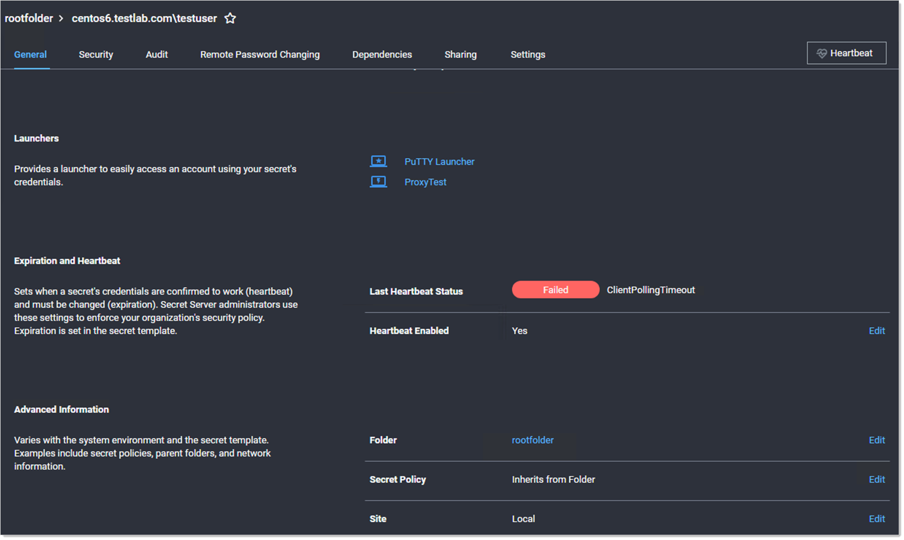
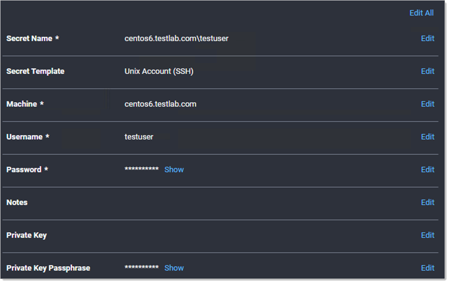
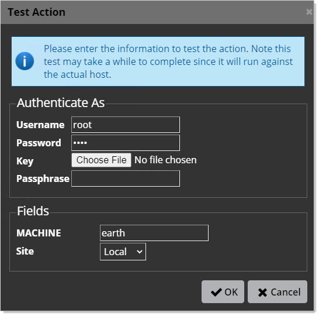
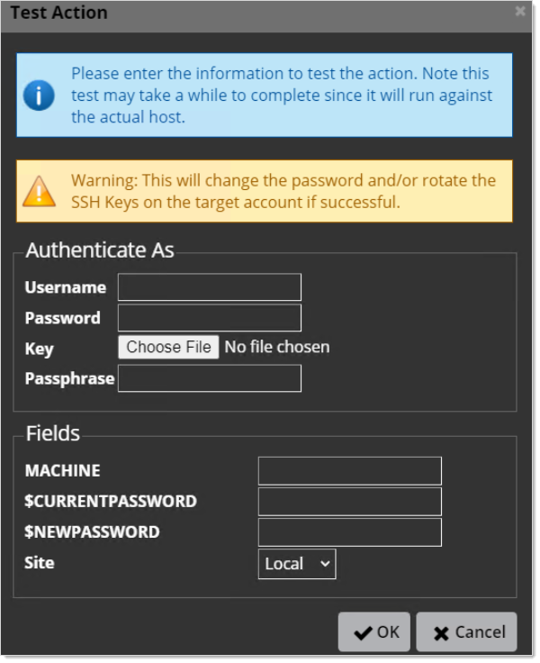
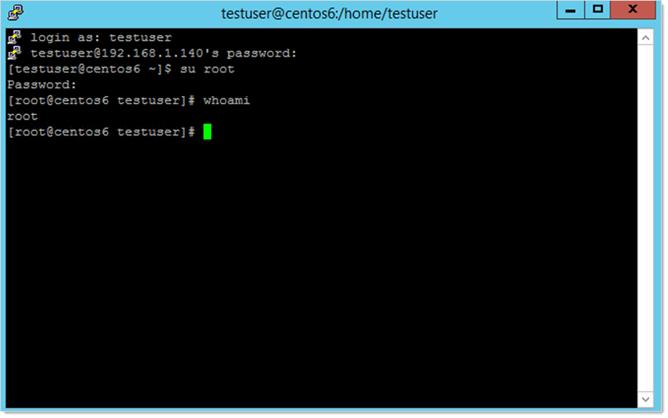
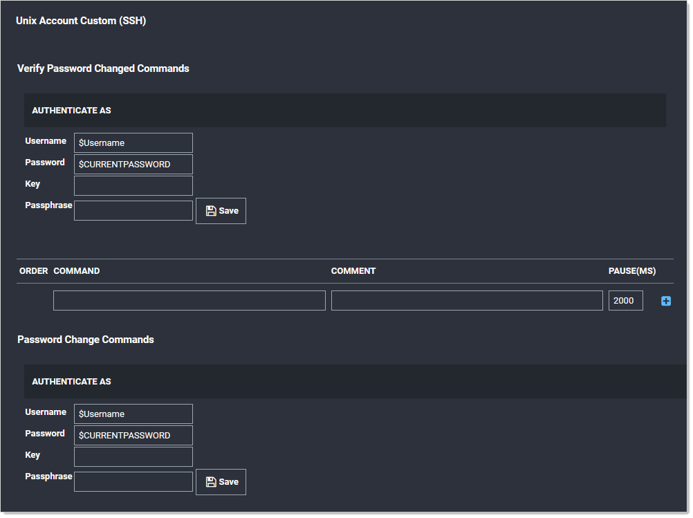
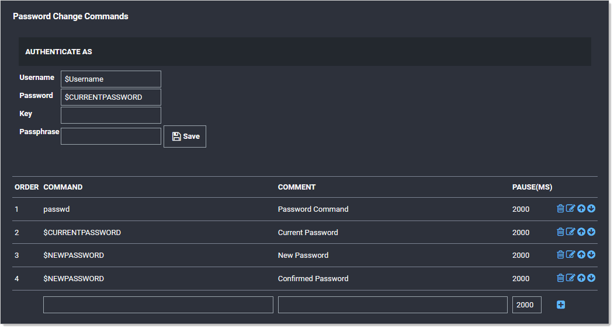

[title]: # (Troubleshooting Heartbeat and RPC Connection Errors for Linux Secrets)
[tags]: # (troubleshooting, workaround, rpc, heartbeat, linux)
[priority]: # (1000)
[display]: # (none)

# Troubleshooting Heartbeat and RPC Connection Errors for Linux Secrets

 When creating custom SSH secret templates in Secret Server (SS), you may run into connection errors such as this:

`Connection Failed - Connection lost (error code is 10058)` 

Please follow these steps to address that. You start with heartbeat and then address Remote Password Changing (RPC). 

> **Note:** See [Troubleshooting SSH Issues](../ssh-issues/index.md) for other SSH issues.

## Step 1: Verifying Ports and Connectivity

To determine if the heartbeat issue is outside of SS: 

1. Go to the errant secret in SS:

   

2. Scroll down to the **Advanced Information** section. You may have to click the **Advanced** link.

3. Note the **Site** parameter.

4. Go to **Admin \> Distributed Engine**.

5. Click the **Manage Sites** button. The Manage Sites page appears:

   

6. Click the **Site Name** link for the site. The Site View page appears.

7. Note the **Processing Location** parameter for the site. 

8. If the processing location is **Local** and website processing is enabled, do your testing on the SS application server. If it is **Distributed Engine**, do your testing on the distributed engine machine.

9. In PowerShell run one of the following command for the machine you are trying to connect to from the secret:

   `Test-NetConnection -ComputerName <computer_name> -Port 22`

   > **Note:** If you chose a custom port, note it—that port will need to be changed on the RPC too.

10. If the test was successful, proceed to the next step. If it was not successful, contact your networking team to open the port and test the connectivity. They can refer to [Ports Used by Secret Server](../../networking/secret-server-ports/index.md). 

## Step 2: Testing Heartbeat and RPC in Secret Server

Procedure:

1. Return to the secret on SS.

3. Click the **Remote Password Changing** tab of the secret (not shown). 

4. Check the **Associated Secret** section to see if there is an associated account set on the secret for use with RPC:

   

4. Return to the **General** tab for the secret:

      

1. Note the **Secret Template** type.

1. Determine the password type for the template:

   1. Go to **Admin > Secret Templates**. 

   1. Click to select the desired template in the dropdown list.

   1. Click the **Edit** button. The Secret Template Designer page appears (not shown).

   1. Click the **Configure Password Changing** button at the bottom of the page. The Secret Template Edit Password Changing page appears:

      

   1. Note the password types used, the applicable secret field, and the equivalent script variable. These indicate reserved variables that reference fields in the secret, in this case, $USERNAME, $MACHINE and $PASSWORD. You will need to test your script using known-good values for these.

1. Go to **Admin > Remote Password Changing**. The Remote Password Changing Configuration page appears (not shown).

1. Click the **Configure Password Changers** button. The Password Changes Configuration page appears:

   

9. Click the name link for the same password changer. The password changer page for that changer appears:

   

   The **Verify Password Changed Commands** section defines the secret fields and commands to use to confirm that a password has rotated (changed) successfully on the target machine. The **Password Change Commands** section defines the secret fields and commands to use to change the password on the target machine.

10. Click the **Edit** button at the bottom of the page. The Edit Password Changer page appears: 

    

11. If a port for the RPC is listed in the **Custom Port** text box, it must match the port that SS connects to when running the commands seen on the previous page.

12. Click the **Cancel** button to return to the previous page:

    

1. The **Verify Password Changed Commands Test Action** button tests the defined password-changed verification listed under it. When clicked, it uses the "Authenticate As" parameters to connect to the accounts and run the commands to test for a heartbeat and check that the account and password is valid.

   > **Note:** This authenticates with a non-privileged associated secret and then uses that account to connect to the Linux machine. This is needed because root accounts are often unable to directly authenticate. Thus, several commands are run to test if the active account can be set to root. If that fails, heartbeat fails.

2. In the example command set for the section, when the heartbeat runs, the associated  account ($[1]$USERNAME) authenticates, logs into the remote SSH device, and runs:

   1. `su $USERNAME` (sets the active account to that in the secret)

   1. `$CURRENTPASSWORD` (provides the current password for that account)

   1. `whoami` (returns the name of the active user, which indicates the su command and the provided parameters worked). This test checks that the returned username is the same as the username field in the secret. If it is not, the heartbeat fails.

   > **Note:** Some of the command sets run by the "Verify Passwords Changed Test Action" button are empty. In that case, the test authenticates with the provided username and password, and if that is successful, so is the heartbeat. That is, the heartbeat uses the secret's own account ($USERNAME) and value to connect, rather than those of an associated secret.

   > **Note:** If the RPC is set up to use an associated secret but the secret does not have one, the secret fails to rotate and throws an error.

   > **Note:** For more on how SS interprets what values to supply your custom script from the secrets involved, see [Editing Custom Commands](../../remote-password-changing/custom-password-changers/editing-custom-commands/index.md) and the [Remote Password Changing Guide](https://thycotic.force.com/support/s/article/SS-Remote-Password-Changing-Guide) (KBA).

3. When you click the Verify Password Changed Commands **Test Action** button, the commands cannot read the fields from a secret or associated secret because when setting up the password changer no specific secret is calling it. Instead, for the test only, you must manually provide the input parameters from your secrets. When you click the button a popup appears for you to do just that:

    

4. Type or select your parameters.

17. Click the **OK** button. The password-changed command set is tested with a simulated heartbeat, using what you entered. If any errors occur, record them for troubleshooting later. The console outputs something similar to this:

    

    You then return to the previous page:

    

18. The **Password Change Commands** section defines the secret fields and commands to use to rotate (change) a password on the target machine. We now run a similar test on it.

20. Click the Password Change Commands **Test Action** button. Another Test Action popup page appears:

    

    >**Important:** Clicking the OK button in the following instructions **really changes the password or rotates the SSH keys on the target account** (the $NEWPASSWORD parameter gets changed), so record what you change it to, and update the secret with the new password (assuming the RPC is successful).

21. Similar to the last test, manually provide the input parameters.

21. Click the **OK** button. The test connects with the "Authenticate As"’ accounts and runs the commands to change the password. A password rotation occurs, and more console output appears. Record any errors and output.

22. If either of the test action buttons, resulted in errors, go to the next step:

## Step 3: Troubleshooting Heartbeat or RPC Outside of Secret Server

This section troubleshoots your previously errant commands outside of SS. The intent is to confirm the commands are correct, and something else is not causing the issue.

1. Use the procedure from Step 1 to determine which machine (SS application or DE) to perform this step on.

2. If you did not already, [Download PuTTY](https://www.chiark.greenend.org.uk/~sgtatham/putty/latest.html) on the application or any of the DE servers. 

3. Open a browser tab on the secret which is failing to Heartbeat or RPC.

4. Do the same for each associated secret of that secret.

   > **Note:** Instead of the following three steps, you can instead go to `…\SecretServer\CustomCommandsEdit.aspx`.

1. Go to **Admin > Remote Password Changing**. The Remote Password Changing Configuration page appears (not shown).

2. Click the **Configure Password Changers** button. The Password Changers Configuration page appears:

      

3. Click the name link for the subject password changer. The password changer configuration page for that changer appears:

      

4. Determine if you are troubleshooting heartbeat or RPC: The **Verify Password Change Commands** section applies to heartbeat, and the **Password Change Commands** section applies to RPC. Which you use (or both) depends on what failed in Step 2.

5. Determine if your are troubleshooting a main or associated secret: Look at the **Authenticate As** sections on the page. If the $USERNAME and $PASSWORD (or $CURRENTPASSWORD) variables are present, you are working with the main secret. If $[1]USERNAME and $[1]PASSWORD variables are present, you are working with an associated secret.

6. Return the machine you were testing.

7. Launch PuTTY.

8. Type the host name or IP address of the subject Linux machine (generally, the Machine field in the secret).

9. Log on with the username and password for the main or associated secret.

    > **Note:** If you are successful with connecting with PuTTY but not SS, launch PuTTY in in debug mode and collect a log file. Determine what cipher was used to connect. If you have a machine that works with SS, compare the ciphers. Also check if the endpoint handles interactive logins differently. SS’s logins for RPC are non-interactive. See [Troubleshooting SSH Issues](../ssh-issues/index.md)  for more information about troubleshooting connection issues in Putty.

14. Use the commands listed in the "Authenticate As" section you are troubleshooting directly in PuTTY to determine if they work outside of SS. For example, given these heartbeat (Verify Password Changed) commands:

    

    Your console would look like this:

    

    In this example, we assumed the secret contained a value of "root" for the Username field, and the associated account in the first position was "testuser." This example was successful because the $$CHECKFOR $USERNAME found "root" on the previous line.

    If the `su root` command were to fail above and reports the message "Username is not in the sudo userers file. This incident will be reported." then the $$CHECKFOR would fail and the heartbeat would fail to verify. This type of issue needs to be remediated on the endpoint.

15. If the issue is clearly an endpoint issue, remediate it and repeat the commands in PuTTY.

16. Once the commands work properly in PuTTY, if the RPC or heartbeat command set needs adjustment to match the working PuTTY equivalent, return to SS and make the changes to the command set (see the next step). 

    > **Important:** Before you change the RPC commands, ensure that the device that you are working on belongs to the secret template you are using. Secret templates dynamically update all the secrets based on them, so **all secrets with this template are affected by your changes**. We strongly recommend that if this device is unique or you are storing an independent root account in the associated secret template, you should:
    >
    > 1. Copy the template you are using, giving the copy a descriptive name.
    > 1. Create a new password changer based on the current one that you are using. 
    > 1. Assign it the the secret template you just created.
    >
    > This ensures that you do not change how ALL devices related to a secret template when you only intend to change a single devices. Accounts that are the same type on the same device should share the same template. 

17. Click the **Edit Commands** button at the bottom of the subject password changer page. The commands for RPC and heartbeat appear:

     

18. Scroll down to the command list in the **Password Change Commands** section:

     

19. Click the blue edit icon to the right of any commands you want to change. The command becomes editable.

20. Edit the command to make it match your known-good revision.

21. Click the blue save icon next to the amended command.

22. Click the **Back** button to return to the password changer page:

    

23. One of the Test Action popups appears.

24. Type the known-good values from the secret in the text boxes.

25. Click the **OK** button to test heartbeat or RPC. The result should look something like this:

    
