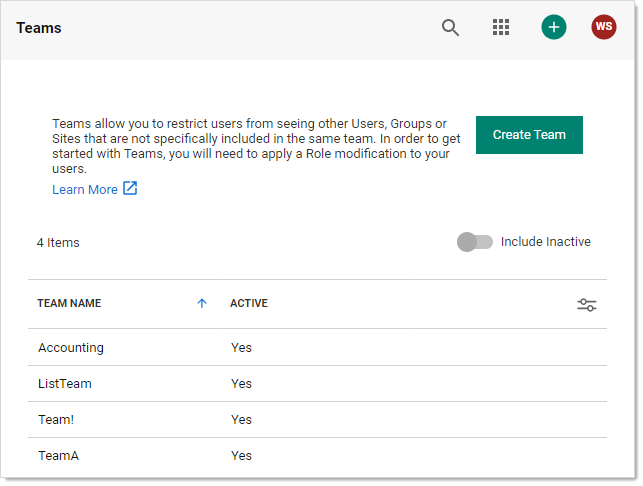
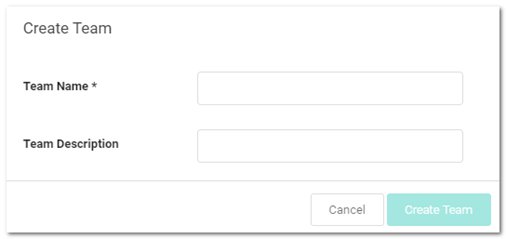
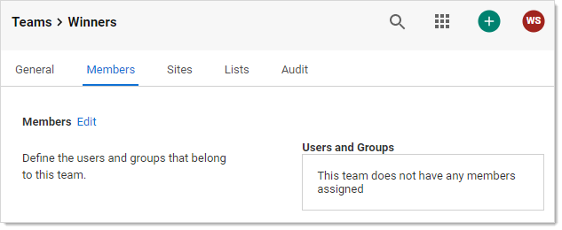
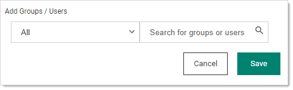
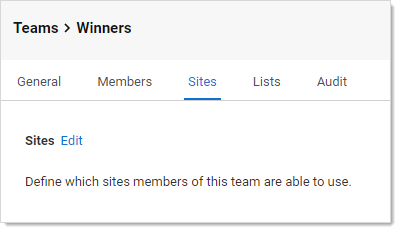
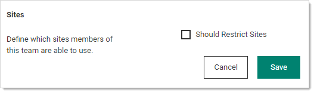
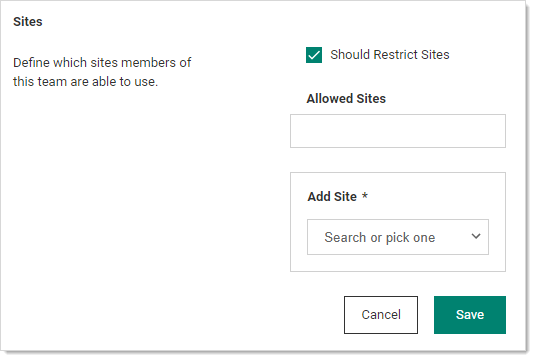
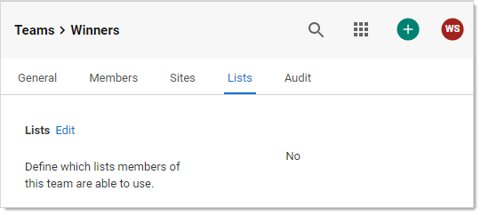
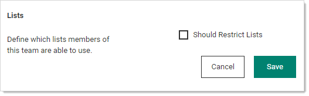
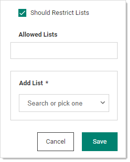

[title]: # (Creating Teams)
[tags]: # (Teams,lists)
[priority]: # (1000)

# Creating Teams

1. Navigate to **Admin \> See All**. The Administration page appears:

1. Click **Teams** in the list. The Teams page appears:

   

1. Click the **Create Team** button. The Create Team popup page appears:

   

1. Type the name for the new team in the **Team Name** text box.

1. (Optional) Type a description in the **Team Description** text box.

1. Click the **Create Team** button. The new team's Members tab appears:

   

1. Click the **Edit** link. An Add Groups / Users section appears:

   

1. Click the dropdown list to select a group of users.

1. Type the name of desired users or groups in the search box.

1. The user or group appears in the Users and Groups box.

1. Repeat the process for additional users and groups.

1. Click the **Save** button.

1. Click the **Sites** tab:

   

1. Click the **Edit** link. The page becomes editable:

   

1. Click to select the **Should Restrict Sites** check box. A Site dropdown list appears:

    

1. Click the **Add Site** list to select a site to restrict the team to. The selected site appears in the Allowed Sites box.

1. Click the **Save** button.

1. Click the **Lists** tab:

     

1. Click the **Edit** link. The page becomes editable:

     

1. Click the **Should Restrict Lists** check box.

     

1. Click the **Add List** dropdown list to select what lists the team members have access to. The chosen list appears in the Allowed Lists box.

1. Repeat the process for any additional lists.

1. Click the **Save** button.

